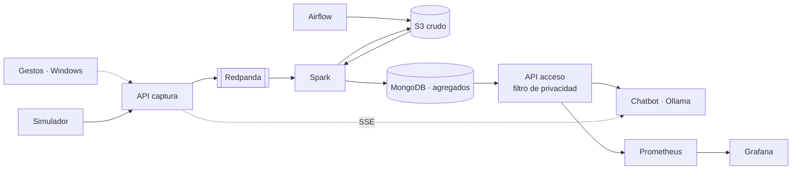

# PIDS 26/27 · Proyecto 1

Plataforma de datos para una empresa de taxis (viajes de taxi amarillo de Nueva York, 2020) con un
agente conversacional para consultarla, bajo el escenario **E3: privacidad total**, e integración con
el reconocimiento de gestos de la parte 1.

| Parte | Qué es | Carpeta |
|---|---|---|
| 1 | Reconocimiento de gestos con MediaPipe | [`parte1_gestos/`](parte1_gestos/) |
| 2 | Plataforma: captura, procesado, almacenamiento, acceso y visualización | [`parte2_plataforma/`](parte2_plataforma/) |
| 3 | Chatbot que consulta la plataforma | [`parte3_chatbot/`](parte3_chatbot/) |
| — | Integración gestos ↔ plataforma ↔ chatbot (última fase) | [`integracion/`](integracion/) |

## E3 en una frase

Los viajes individuales solo existen en una zona restringida (S3 y la cola de eventos) a la que solo
acceden la ingesta y Spark. Lo consultable son **agregados** con los grupos de menos de 10 viajes
ocultos, y la única puerta es una API que rechaza cualquier consulta individual, propone una
alternativa y lo registra todo. Detalle en [`docs/escenario_E3.md`](docs/escenario_E3.md).

## Tecnologías

Docker Compose · Redpanda · Spark 4 (Scala, modo cluster) · MongoDB · SeaweedFS (S3) · FastAPI ·
Airflow 3 · Prometheus + Grafana · Ollama (LLM local con GPU) · Chainlit.
Por qué cada una: [`docs/comparativa.md`](docs/comparativa.md). Arquitectura: [`docs/arquitectura.md`](docs/arquitectura.md).



## Puesta en marcha

Dentro de Ubuntu (WSL2), en la raíz del repositorio (requisitos en [`docs/herramientas.md`](docs/herramientas.md)):

```bash
make entorno              # genera .env con claves aleatorias
make sync && make test    # entorno Python y tests
make nucleo               # S3, Redpanda, MongoDB y APIs
make airflow              # + Spark y Airflow
make historico-muestra    # carga el CSV de muestra (Airflow → Spark → MongoDB)
make observabilidad       # + Prometheus y Grafana
make chatbot              # + Ollama y chatbot (SIN_GPU=1 si no hay GPU NVIDIA)
make tiempo-real          # arranca el streaming en Spark
make simular              # envía viajes a la API de captura
make                      # lista de todos los comandos
```

| Servicio | URL |
|---|---|
| Chatbot | http://localhost:8010 |
| Airflow | http://localhost:8085 |
| Grafana | http://localhost:3000 |
| Spark | http://localhost:8090 |
| API de acceso | http://localhost:8002/docs |
| API de captura | http://localhost:8001/docs |

Las contraseñas y claves están en `.env`.

## Estructura

```
├── config/                  reglas compartidas Python/Scala: esquema del viaje y privacidad
├── data/muestra/            los 999 viajes de ejemplo (el resto de datos no se versiona)
├── docker/                  imagen común de los servicios Python
├── docs/                    plan, arquitectura, comparativa, E3, métricas, casos de uso, datos
├── parte1_gestos/
├── parte2_plataforma/
│   ├── comun/               esquema y reglas de privacidad (Python)
│   ├── captura/             API de entrada de eventos
│   ├── acceso/              API de consulta con filtro de privacidad
│   ├── spark/               trabajos Scala: CargaHistorica y TiempoReal
│   ├── airflow/             imagen y DAG
│   ├── s3/  mongodb/        inicialización del almacenamiento
│   ├── simulador/           reenvío de viajes como tiempo real
│   └── observabilidad/      Prometheus y Grafana
├── parte3_chatbot/          Chainlit + Ollama
├── integracion/             cliente de gestos (Windows)
├── scripts/                 descarga, perfilado y generación de .env
├── tests/                   tests de Python (los de Scala están en parte2_plataforma/spark)
├── docker-compose.yml
└── Makefile
```

## Equipo

Javier Saguar · Alejandro Cuevas · Mónica Fernández · Pedro José Orrego · Daniel Naval

Reparto de tareas en [`docs/plan.md`](docs/plan.md).

## Cómo trabajamos

Dos ficheros llevan el día a día del proyecto. **Léelos antes de ponerte a trabajar** y, si usas un
asistente de IA, pásaselos como primer contexto: así nadie trabaja con información desactualizada.

| Fichero | Para qué |
|---|---|
| [`TAREAS.md`](TAREAS.md) | Las **10 tareas siguientes**, en orden, con qué hay que hacer y cuándo se considera terminada. Coges una, pones tu nombre y la marcas al acabar |
| [`BITACORA.md`](BITACORA.md) | Qué se ha hecho ya: cada cambio con su motivo, cómo comprobarlo y qué quedó pendiente. Incluye el estado actual del proyecto y las decisiones tomadas |

Cada cambio termina con una entrada en la bitácora y su tarea actualizada; los *pull requests* lo
recuerdan con una casilla.
