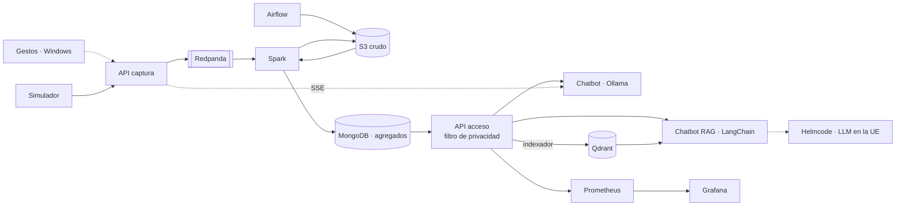

# PIDS 26/27 · Proyecto 1

[](https://github.com/javiersaguar/PIDS-Proyecto1/actions/workflows/ci.yml)

Plataforma de datos para una empresa de taxis (viajes de taxi amarillo de Nueva York, 2020) con dos chatbots
para consultarla, bajo el escenario **E3: privacidad total**, e integración con el reconocimiento de gestos de
la parte 1.

| Parte | Qué es | Carpeta |
|---|---|---|
| 1 | Reconocimiento de gestos con MediaPipe | [`parte1_gestos/`](parte1_gestos/) |
| 2 | Plataforma: captura, procesado, almacenamiento, acceso y visualización | [`parte2_plataforma/`](parte2_plataforma/) |
| 3 | Chatbot con LLM local (Ollama) que consulta la plataforma | [`parte3_chatbot/`](parte3_chatbot/) |
| 3 bis | Chatbot RAG: LangChain + Qdrant + LLM externo en la UE (Helmcode) | [`parte3_chatbot_rag/`](parte3_chatbot_rag/) |
| — | Integración gestos ↔ plataforma ↔ chatbot (última fase) | [`integracion/`](integracion/) |

## Stack tecnológico

**Plataforma de datos**


**APIs y chatbots**


**Reconocimiento de gestos**


**Despliegue y calidad**


Por qué cada tecnología: [`docs/comparativa.md`](docs/comparativa.md). Arquitectura: [`docs/arquitectura.md`](docs/arquitectura.md).

## E3 en una frase

Los viajes individuales solo existen en una zona restringida (S3 y la cola de eventos) a la que solo
acceden la ingesta y Spark. Lo consultable son **agregados** con los grupos de menos de 10 viajes
ocultos, y la única puerta es una API que rechaza cualquier consulta individual, propone una
alternativa y lo registra todo. Los dos chatbots solo ven esos agregados; el RAG los envía, junto con la
pregunta, a un LLM que se ejecuta en la UE sin registro de datos, y el de Ollama no saca nada del equipo.
Detalle en [`docs/escenario_E3.md`](docs/escenario_E3.md) y, para el chatbot RAG,
[`parte3_chatbot_rag/CONTRATOS.md`](parte3_chatbot_rag/CONTRATOS.md).



## Puesta en marcha

Dentro de Ubuntu (WSL2), en la raíz del repositorio (requisitos en [`docs/herramientas.md`](docs/herramientas.md)):

```bash
make entorno              # genera .env con claves aleatorias (make entorno-completar si ya tenías uno)
make sync && make test    # entorno Python y tests
make nucleo               # S3, Redpanda, MongoDB y APIs
make airflow              # + Spark y Airflow
make historico-muestra    # carga el CSV de muestra (Airflow → Spark → MongoDB)
make observabilidad       # + Prometheus y Grafana
make chatbot              # + Ollama y chatbot local (SIN_GPU=1 si no hay GPU NVIDIA)
make rag-comprobar        # comprueba el proveedor del LLM externo (pega antes LLM_API_KEY en .env)
make chatbot-rag          # + Qdrant y chatbot RAG
make rag-indexar          # indexa en Qdrant el conocimiento y las fichas de agregados
make tiempo-real          # arranca el streaming en Spark
make simular              # envía viajes a la API de captura
make                      # lista de todos los comandos
```

| Servicio | URL |
|---|---|
| Chatbot (Ollama) | http://localhost:8010 |
| Chatbot RAG | http://localhost:8011 |
| Airflow | http://localhost:8085 |
| Grafana | http://localhost:3000 |
| Spark | http://localhost:8090 |
| Qdrant | http://localhost:6333/dashboard |
| API de acceso | http://localhost:8002/docs |
| API de captura | http://localhost:8001/docs |

Las contraseñas y claves están en `.env`. La única que no se genera sola es `LLM_API_KEY`, la del proveedor
del LLM externo, que se pega a mano desde el panel de Helmcode.

## Estructura

```
├── config/                  reglas compartidas Python/Scala: esquema del viaje y privacidad
├── data/muestra/            los 999 viajes de ejemplo (el resto de datos no se versiona)
├── docker/                  imagen común de los servicios Python
├── docs/                    plan, arquitectura, comparativa, E3, métricas, casos de uso, datos
├── parte1_gestos/
├── parte2_plataforma/
│   ├── comun/               esquema y reglas de privacidad (Python)
│   ├── captura/             API de entrada de eventos
│   ├── acceso/              API de consulta con filtro de privacidad
│   ├── spark/               trabajos Scala: CargaHistorica y TiempoReal
│   ├── airflow/             imagen y DAG
│   ├── s3/  mongodb/        inicialización del almacenamiento
│   ├── simulador/           reenvío de viajes como tiempo real
│   └── observabilidad/      Prometheus y Grafana
├── parte3_chatbot/          Chainlit + Ollama: agente, herramientas y barreras sobre las cifras
├── parte3_chatbot_rag/      Chainlit + LangChain + Qdrant + Helmcode; reutiliza las herramientas y
│                            barreras del anterior. CONTRATOS.md reparte el trabajo en cinco bloques
├── integracion/             cliente de gestos (Windows)
├── scripts/                 descarga, perfilado, generación de .env, auditoría, latencia y ataques
├── tests/                   tests de Python (los de Scala están en parte2_plataforma/spark)
├── docker-compose.yml       perfiles: spark, airflow, observabilidad, chatbot, rag, rag-indexar,
│                            herramientas, simulador
└── Makefile
```

## Equipo y ramas

Cada persona trabaja en su propia rama y lleva sus cambios a `main` con un *pull request*; nadie sube
directamente a `main`. Así no nos pisamos el trabajo.

| Persona | Rama | Responsabilidad principal |
|---|---|---|
| Javier Saguar | `javier-saguar` | Spark (Scala): histórico y tiempo real; parte 1 |
| Alejandro Cuevas | `alejandro-cuevas` | Almacenamiento, cola y despliegue (Compose, S3, MongoDB, Redpanda) |
| Mónica Fernández | `monica-fernandez` | APIs y reglas de privacidad |
| Pedro José Orrego | `pedro-jose-orrego` | Airflow, Prometheus, Grafana y métricas de calidad |
| Daniel Naval | `daniel-naval` | Chatbot, casos de uso e integración con los gestos |

Reparto completo en [`docs/plan.md`](docs/plan.md).

```bash
git fetch origin
git switch <tu-rama>          # la primera vez la crea a partir de origin/<tu-rama>
git merge origin/main         # al empezar el día y antes de abrir el pull request
git push origin <tu-rama>     # y el pull request, de <tu-rama> a main
```

Para una tarea larga puedes abrir una rama de tarea (`tarea/...`) a partir de la tuya. El chatbot RAG se
construye así: la rama `tarea/rag-base` lleva la infraestructura y cada bloque (`rag/2-corpus`,
`rag/3-agente`, `rag/4-interfaz`, `rag/5-privacidad`) se fusiona en ella antes del *pull request* a `main`;
el reparto de ficheros y las firmas están en [`parte3_chatbot_rag/CONTRATOS.md`](parte3_chatbot_rag/CONTRATOS.md).

## Cómo trabajamos

Dos ficheros llevan el día a día del proyecto. **Léelos antes de ponerte a trabajar** y, si usas un
asistente de IA, pásaselos como primer contexto: así nadie trabaja con información desactualizada.

| Fichero | Para qué |
|---|---|
| [`TAREAS.md`](TAREAS.md) | Las **10 tareas siguientes**, en orden, con qué hay que hacer y cuándo se considera terminada. Coges una, pones tu nombre y la marcas al acabar |
| [`BITACORA.md`](BITACORA.md) | Qué se ha hecho ya: cada cambio con su motivo, cómo comprobarlo y qué quedó pendiente. Incluye el estado actual del proyecto y las decisiones tomadas |

Cada cambio termina con una entrada en la bitácora y su tarea actualizada; los *pull requests* lo
recuerdan con una casilla.
