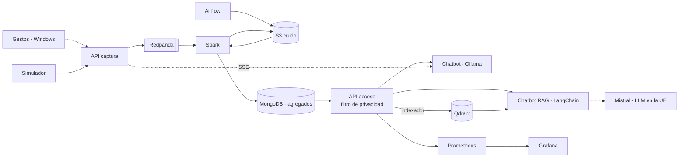

# PIDS 26/27 · Proyecto 1

[](https://github.com/javiersaguar/PIDS-Proyecto1/actions/workflows/ci.yml)

Plataforma de datos para una empresa de taxis (viajes de taxi amarillo de Nueva York, 2020) con dos chatbots
para consultarla, bajo el escenario **E3: privacidad total**, e integración con el reconocimiento de gestos de
la parte 1.

| Parte | Qué es | Carpeta |
|---|---|---|
| 1 | Reconocimiento de gestos con MediaPipe | [`parte1_gestos/`](parte1_gestos/) |
| 2 | Plataforma: captura, procesado, almacenamiento, acceso y visualización | [`parte2_plataforma/`](parte2_plataforma/) |
| 3 | Chatbot con LLM local (Ollama) que consulta la plataforma | [`parte3_chatbot/`](parte3_chatbot/) |
| 3 bis | Chatbot RAG: LangChain + Qdrant + LLM externo en la UE (Mistral) | [`parte3_chatbot_rag/`](parte3_chatbot_rag/) |
| — | Integración gestos ↔ plataforma ↔ chatbots: la demo de Windows o la cámara del navegador (el MLP de la parte 1 en el portal, también en Vercel) manejan los tres chatbots | [`integracion/`](integracion/) |
| 4 | Portal web corporativo: panel, explorador, asistente, tiempo real, auditoría y operaciones | [`parte4_frontend/`](parte4_frontend/) |

## Stack tecnológico

**Plataforma de datos**


**APIs y chatbots**


**Reconocimiento de gestos**


**Despliegue y calidad**


Por qué cada tecnología: [`docs/comparativa.md`](docs/comparativa.md). Arquitectura: [`docs/arquitectura.md`](docs/arquitectura.md).

## E3 en una frase

Los viajes individuales solo existen en una zona restringida (S3 y la cola de eventos) a la que solo
acceden la ingesta y Spark. Lo consultable son **agregados** con los grupos de menos de 10 viajes
ocultos, y la única puerta es una API que rechaza cualquier consulta individual, propone una
alternativa y lo registra todo. Los dos chatbots solo ven esos agregados; el RAG los envía, junto con la
pregunta, a un LLM que se ejecuta en la UE sin registro de datos, y el de Ollama no saca nada del equipo.
Detalle en [`docs/escenario_E3.md`](docs/escenario_E3.md) y, para el chatbot RAG,
[`parte3_chatbot_rag/CONTRATOS.md`](parte3_chatbot_rag/CONTRATOS.md).



## Puesta en marcha

Todo se ejecuta dentro de Ubuntu (WSL2), en la raíz del repositorio; la parte 1 (gestos) va en Windows y tiene
sus instrucciones en [`parte1_gestos/`](parte1_gestos/). Requisitos en [`docs/herramientas.md`](docs/herramientas.md):
Docker con Compose, `uv`, Node 22 (solo para desarrollar el portal) y, para el chatbot con GPU, el NVIDIA Container
Toolkit.

### La primera vez

```bash
make entorno              # .env con claves y contraseñas aleatorias (con un .env antiguo: make entorno-completar)
make rag-clave            # pega LLM_API_KEY (console.mistral.ai, plan gratuito): la única clave que no se genera sola
make sync && make test    # entorno Python y tests
make construir            # todas las imágenes (unos minutos la primera vez)
make todo                 # levanta toda la plataforma, portal web incluido
make estado               # espera a que todo esté «running» o «healthy»
make historico-muestra    # primera carga: los 999 viajes de muestra (Airflow → Spark → MongoDB)
make rag-comprobar        # comprueba el proveedor del LLM externo
make rag-indexar          # índice de Qdrant para el chatbot RAG (tras cada carga grande)
```

Para datos de verdad: `make historico MES=2020-01` carga un mes desde la TLC; el año 2020 completo se cargó con
`make subir-csv` y `make historico-fichero` (bitácora del 17/09). En un equipo sin GPU NVIDIA, añade `SIN_GPU=1`
(`make todo SIN_GPU=1`) y pon `OLLAMA_MODELO=llama3.2:3b` en `.env`.

### Cada día

```bash
make arrancar             # todo en uno: levanta lo que esté parado, lanza el tiempo real si no está, abre el
                          # túnel si hay datos de ngrok y comprueba portal, chatbots, Airflow, Grafana y la
                          # clave del LLM externo (ARGS=--sin-tunel para no tocar el túnel)
make rag-clave            # si avisa de que el proveedor rechaza LLM_API_KEY: pega la nueva (no se muestra)
make capturar             # captura en directo: viajes reales de diciembre de 2020 entrando ahora (o el botón
                          # «Capturar datos» del grafo del portal); make capturar-parar la para
make parar                # al terminar: lo para todo y conserva los datos
```

`make arrancar` equivale a `make todo`, `make tiempo-real` (sin lanzar un segundo trabajo si ya hay uno) y
`make tunel`. No pares la plataforma con Ctrl+C sobre un `docker compose up`: eso para el núcleo (S3, Redpanda,
MongoDB y las APIs) y el portal y los chatbots se quedan sin datos.

La captura en directo necesita una vez `make captura-preparar` (descarga el mes de la TLC y lo parte por días). Sigue
donde se quedó; para volver a empezar por el 1 de diciembre, `make tiempo-real-reiniciar`, que deja el tiempo real
desde cero (el histórico no se toca).

`make borrar-todo` borra además los volúmenes (datos, usuarios, modelos): solo si quieres empezar de cero.

### Entrar

| Servicio | URL | Usuario y contraseña |
|---|---|---|
| **Portal web** | http://localhost:8020 | Solo contraseña: `FRONTEND_CLAVE` de `.env` |
| Chatbot (Ollama) | http://localhost:8010 | `CHATBOT_USUARIO` / `CHATBOT_CLAVE` |
| Chatbot RAG | http://localhost:8011 (`PUERTO_CHATBOT_RAG`) | las mismas |
| Airflow | http://localhost:8085 | `AIRFLOW_ADMIN_USER` / `AIRFLOW_ADMIN_PASSWORD` |
| Grafana | http://localhost:3000 (y en el portal, sección Observabilidad) | Ver, sin clave; editar, `admin` / `GRAFANA_ADMIN_PASSWORD` |
| API de acceso | http://localhost:8002/docs | Cabecera `X-API-Key`: `ACCESO_CLAVE_EQUIPO` |
| API de captura | http://localhost:8001/docs | Cabecera `X-API-Key`: `CAPTURA_CLAVE_SIMULADOR` |

Spark, Prometheus, Ollama, Qdrant, Kafka y la consola de Redpanda no se publican: no tienen login.
Se usan desde dentro de Docker. El detalle está en [`docs/seguridad.md`](docs/seguridad.md).

```bash
grep '^FRONTEND_CLAVE=' .env      # la contraseña del portal
```

Cada `.env` es de su equipo y no se sube a Git (cada persona tiene sus propias claves). Para elegir tú la contraseña
del portal, cambia `FRONTEND_CLAVE` en `.env` y ejecuta `make frontend`, que recrea el contenedor. Todos los puertos se
publican solo en `127.0.0.1`; si uno está ocupado en tu equipo, cámbialo en `.env` (`PUERTO_*`). Si `.env` es de antes
del portal, `make entorno-completar` le añade sus claves y `docker compose up -d --no-deps acceso-a acceso-b` hace que la API de
acceso reconozca al cliente `frontend`.

### Portal web y web pública

- **En el equipo:** `make frontend` construye y levanta el portal (http://localhost:8020). Para desarrollarlo,
  `make frontend-dev` (BFF con recarga) y, en otra terminal, `cd parte4_frontend/web && npm run dev`
  (http://localhost:5173). Detalles en [`parte4_frontend/README.md`](parte4_frontend/README.md).
- **Web pública (Vercel):** publica `main` con [`vercel.json`](vercel.json). Si el equipo tiene levantado el túnel,
  muestra la plataforma **en vivo** (con la contraseña del portal); si no, una **demostración** con datos grabados. El
  aviso de abajo a la izquierda dice en cuál está y deja cambiar. Cómo funciona:
  [`parte4_frontend/demo/README.md`](parte4_frontend/demo/README.md).

Para el modo en vivo, una vez:

1. Cuenta gratuita en https://ngrok.com. En el panel, *Your Authtoken* (el token) y *Domains → New Domain* (un dominio
   fijo gratuito, del tipo `algo-aleatorio.ngrok-free.app`).
2. Pegar los dos en `.env`: `NGROK_AUTHTOKEN=…` y `NGROK_DOMINIO=algo-aleatorio.ngrok-free.app` (sin `https://`).
3. Poner ese dominio en la regla `/api` de `vercel.json` y subirlo a `main`.

Después, cada vez: `make tunel` para encenderlo y `make tunel-parar` para apagarlo. El túnel solo expone el portal,
con su contraseña; ningún otro servicio sale del equipo.

`make` lista todos los comandos.

## Estructura

```
├── config/                  reglas compartidas Python/Scala: esquema del viaje y privacidad
├── data/muestra/            los 999 viajes de ejemplo (el resto de datos no se versiona)
├── docker/                  imagen común de los servicios Python
├── docs/                    plan, arquitectura, comparativa, E3, métricas, casos de uso, datos, guion de la demo
├── parte1_gestos/
├── parte2_plataforma/
│   ├── comun/               esquema y reglas de privacidad (Python)
│   ├── captura/             API de entrada de eventos
│   ├── acceso/              API de consulta con filtro de privacidad
│   ├── spark/               trabajos Scala: CargaHistorica y TiempoReal
│   ├── airflow/             imagen y DAG
│   ├── s3/  mongodb/        inicialización del almacenamiento
│   ├── simulador/           reenvío de viajes como tiempo real
│   └── observabilidad/      Prometheus y Grafana
├── parte3_chatbot/          Chainlit + Ollama: agente, herramientas y barreras sobre las cifras
├── parte3_chatbot_rag/      Chainlit + LangChain + Qdrant + Mistral; reutiliza las herramientas y
│                            barreras del anterior. CONTRATOS.md reparte el trabajo en cinco bloques
├── parte4_frontend/         portal web: BFF de FastAPI (bff/) y SPA de React (web/)
├── integracion/             cliente de gestos (Windows)
├── scripts/                 descarga, perfilado, generación de .env, auditoría, latencia y ataques
├── tests/                   tests de Python (los de Scala están en parte2_plataforma/spark)
├── docker-compose.yml       perfiles: spark, airflow, observabilidad, chatbot, rag, rag-indexar,
│                            frontend, herramientas, simulador
├── vercel.json              demostración pública del portal en Vercel (parte4_frontend/demo)
└── Makefile
```

## Equipo y ramas

Cada persona trabaja en su propia rama y lleva sus cambios a `main` con un *pull request*; nadie sube
directamente a `main`. Así no nos pisamos el trabajo.

| Persona | Rama | Responsabilidad principal |
|---|---|---|
| Javier Saguar | `javier-saguar` | Spark (Scala): histórico y tiempo real; parte 1 |
| Alejandro Cuevas | `alejandro-cuevas` | Almacenamiento, cola y despliegue (Compose, S3, MongoDB, Redpanda) |
| Mónica Fernández | `monica-fernandez` | APIs y reglas de privacidad |
| Pedro José Orrego | `pedro-jose-orrego` | Airflow, Prometheus, Grafana y métricas de calidad |
| Daniel Naval | `daniel-naval` | Chatbot, casos de uso e integración con los gestos |

Reparto completo en [`docs/plan.md`](docs/plan.md).

```bash
git fetch origin
git switch <tu-rama>          # la primera vez la crea a partir de origin/<tu-rama>
git merge origin/main         # al empezar el día y antes de abrir el pull request
git push origin <tu-rama>     # y el pull request, de <tu-rama> a main
```

Para una tarea larga puedes abrir una rama de tarea (`tarea/...`) a partir de la tuya. El chatbot RAG se
construye así: la rama `tarea/rag-base` lleva la infraestructura y cada bloque (`rag/2-corpus`,
`rag/3-agente`, `rag/4-interfaz`, `rag/5-privacidad`) se fusiona en ella antes del *pull request* a `main`;
el reparto de ficheros y las firmas están en [`parte3_chatbot_rag/CONTRATOS.md`](parte3_chatbot_rag/CONTRATOS.md).

## Cómo trabajamos

Dos ficheros llevan el día a día del proyecto. **Léelos antes de ponerte a trabajar** y, si usas un
asistente de IA, pásaselos como primer contexto: así nadie trabaja con información desactualizada.

| Fichero | Para qué |
|---|---|
| [`TAREAS.md`](TAREAS.md) | Las **10 tareas siguientes**, en orden, con qué hay que hacer y cuándo se considera terminada. Coges una, pones tu nombre y la marcas al acabar |
| [`BITACORA.md`](BITACORA.md) | Qué se ha hecho ya: cada cambio con su motivo, cómo comprobarlo y qué quedó pendiente. Incluye el estado actual del proyecto y las decisiones tomadas |

Cada cambio termina con una entrada en la bitácora y su tarea actualizada; los *pull requests* lo
recuerdan con una casilla.

**Autoría:** en el repositorio solo figuramos los cinco del grupo. Ejecuta `make hooks` (o `make sync`) una
vez en tu copia: el hook quita de los commits las coautorías y firmas que añaden algunas herramientas, y el CI
«Autoría» rechaza los commits y *pull requests* que las lleven. Si tu copia es anterior al 22/09/2026, o si
Vercel deja de desplegar, lee [`docs/repositorio.md`](docs/repositorio.md). Los asistentes de programación
tienen sus instrucciones en [`AGENTS.md`](AGENTS.md).
