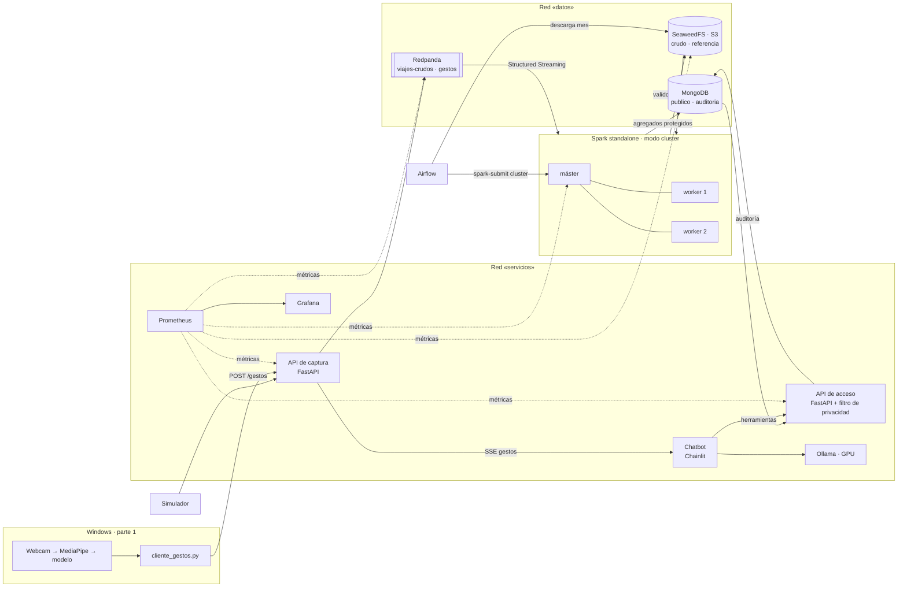

# Arquitectura

## Componentes

| Componente | Tecnología | Función | Qué datos ve |
|---|---|---|---|
| Almacenamiento de objetos | SeaweedFS 4.47 (S3) | Zona restringida `crudo` (viajes individuales) y `referencia` (zonas) | Individuales |
| Cola de eventos | Redpanda 25.2 (API Kafka) | `viajes-crudos` (retención 24 h) y `gestos` (1 h) | Individuales |
| Procesado | Spark 4.0.4 (Scala), standalone, modo cluster | Validación, archivo y agregación protegida; lotes y streaming | Individuales |
| Base de datos | MongoDB 8.0 | `publico` (solo agregados) y `auditoria` (solo inserción) | Agregados |
| Captura | FastAPI | Entrada HTTP de viajes y gestos; SSE de gestos | Individuales (de paso) |
| Acceso | FastAPI | Única puerta a los datos: filtro de privacidad y auditoría | Agregados |
| Orquestación | Airflow 3.3 (LocalExecutor) | Carga histórica: descarga → S3 → Spark → comprobación | Individuales (solo ficheros) |
| Monitorización | Prometheus 3.1 + Grafana 11.5 | Métricas técnicas y agregados protegidos | Métricas |
| Chatbot | Chainlit + Ollama (llama3.1:8b, GPU) | Conversación; solo usa la API de acceso | Agregados |

Airflow usa además un PostgreSQL interno solo para sus metadatos; no guarda datos del proyecto.

## Flujos

1. **Histórico:** `make historico MES=2020-03` → DAG `pids_carga_historica` → Parquet de la TLC a
   `s3://crudo/historico/` → `pids.CargaHistorica` (modo cluster) → válidos y rechazos a `s3://crudo/`
   → agregados de 3 niveles a `publico.*` → resumen de la carga a `auditoria.cargas`.
2. **Tiempo real:** simulador o proveedor → `POST /viajes` → `viajes-crudos` → `pids.TiempoReal`
   (supervisado) → mismas reglas → `publico.tr_*` cada 30 s.
3. **Consulta:** chatbot → herramienta → `POST /consultas` → filtro → MongoDB → enmascarado →
   respuesta + registro en `auditoria.decisiones`.
4. **Gestos (último):** demo → `POST /gestos` → `gestos` → SSE → chatbot.

## Monitorización y alertas

Prometheus sondea cada 15 s las APIs, Redpanda, SeaweedFS y Spark. Grafana solo ve esas métricas (no tiene
credenciales de datos) y todo se provisiona por ficheros: el panel `plataforma.json` y tres alertas en
`observabilidad/grafana/provisioning/alerting/reglas.json`, evaluadas cada 30 s.

| Alerta | Condición (resumida) | Qué indica |
|---|---|---|
| Exceso de consultas rechazadas | `sum(increase(acceso_consultas_total{resultado="rechazada"}[5m])) > 20` durante 1 min | Posible intento de reidentificación. Las baterías de pruebas también la disparan |
| Tiempo real sin publicar con tráfico | frescura > 300 s **y** `rate(captura_eventos_total{tipo="viaje"}[5m]) > 0`, durante 1 min | Entran viajes pero Spark no escribe agregados; con el simulador parado no salta |
| Servicio no disponible | `up == 0` por job, durante 1 min | Un servicio no responde al sondeo de Prometheus |

La **frescura** es la métrica `publico_ultima_actualizacion_timestamp_segundos{fuente="tiempo_real"}`: el
`actualizado_en` más reciente de `tr_viajes_hora_zona`, que Spark escribe al publicar. Mide cuándo se procesó,
no la fecha de los viajes (que es de 2020). La API de acceso la refresca cada 60 s y solo la lee de la colección
de tiempo real, para no ordenar cada minuto los 717 000 documentos del histórico.

Las alertas solo se ven en Grafana (panel «Alertas activas de PIDS» y menú *Alerting*): la política de
notificación de `notificaciones.json` las silencia siempre, así que Grafana no intenta enviar ningún correo.

## Redes y puertos

Dos redes Docker: `datos` (S3, Redpanda, MongoDB y quien los usa) y `servicios` (APIs, chatbot,
Grafana). **El chatbot y Grafana no están en la red de datos.** Todos los puertos se publican solo
en `127.0.0.1`:

| Servicio | URL |
|---|---|
| API de captura | http://localhost:8001/docs |
| API de acceso | http://localhost:8002/docs |
| Chatbot | http://localhost:8010 |
| Spark (máster) | http://localhost:8090 |
| Airflow | http://localhost:8085 |
| Grafana | http://localhost:3000 |
| Prometheus | http://localhost:9090 |
| Consola de Redpanda | http://localhost:8088 |
| S3 | http://localhost:8333 |
| MongoDB | mongodb://localhost:27018 |
