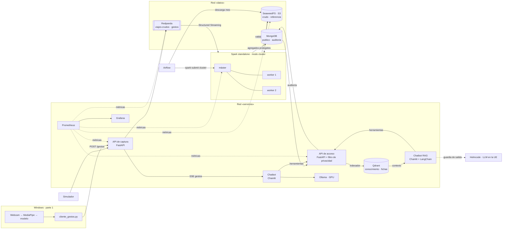

# Arquitectura



## Componentes

| Componente | Tecnología | Función | Qué datos ve |
|---|---|---|---|
| Almacenamiento de objetos | SeaweedFS 4.47 (S3) | Zona restringida `crudo` (viajes individuales) y `referencia` (zonas) | Individuales |
| Cola de eventos | Redpanda 25.2 (API Kafka) | `viajes-crudos` (retención 24 h) y `gestos` (1 h) | Individuales |
| Procesado | Spark 4.0.4 (Scala), standalone, modo cluster | Validación, archivo y agregación protegida; lotes y streaming | Individuales |
| Base de datos | MongoDB 8.0 | `publico` (solo agregados) y `auditoria` (solo inserción) | Agregados |
| Captura | FastAPI | Entrada HTTP de viajes y gestos; SSE de gestos | Individuales (de paso) |
| Acceso | FastAPI, dos réplicas detrás de un proxy Caddy | Única puerta a los datos: filtro de privacidad y auditoría | Agregados |
| Orquestación | Airflow 3.3 (LocalExecutor) | Carga histórica: descarga → S3 → Spark → comprobación | Individuales (solo ficheros) |
| Monitorización | Prometheus 3.1 + Grafana 11.5 | Métricas técnicas y agregados protegidos | Métricas |
| Chatbot | Chainlit + Ollama (llama3.1:8b, GPU) | Conversación; solo usa la API de acceso | Agregados |
| Chatbot RAG | Chainlit + LangChain 1.4 + Helmcode (`deepseek-v4-flash`, UE) | Conversación con recuperación de contexto; las mismas herramientas y barreras que el chatbot de Ollama; guardia de salida antes de cada llamada al proveedor | Agregados y documentación |
| Índice vectorial | Qdrant 1.19 | Colecciones `conocimiento` (docs, catálogo, zonas, ejemplos) y `agregados_gruesos` (fichas de día-barrio y flujos, obtenidas por la API de acceso) | Agregados protegidos |
| Portal web (parte 4) | FastAPI (BFF) + React | Panel, explorador, asistente, tiempo real, auditoría y operaciones en una sola aplicación; el BFF guarda las claves y el navegador entra con una contraseña única | Agregados y auditoría |

Airflow usa además un PostgreSQL interno solo para sus metadatos; no guarda datos del proyecto. El chatbot RAG
está descrito en detalle en [`chatbot_rag.md`](chatbot_rag.md).

## Flujos

1. **Histórico:** `make historico MES=2020-03` → DAG `pids_carga_historica` → Parquet de la TLC a
   `s3://crudo/historico/` → `pids.CargaHistorica` (modo cluster) → válidos y rechazos a `s3://crudo/`
   → agregados de 3 niveles a `publico.*` → resumen de la carga a `auditoria.cargas`.
2. **Tiempo real:** simulador o proveedor → `POST /viajes` → `viajes-crudos` → `pids.TiempoReal`
   (supervisado) → mismas reglas → `publico.tr_*` cada 30 s.
3. **Consulta:** chatbot → herramienta → `POST /consultas` → filtro → MongoDB → enmascarado →
   respuesta + registro en `auditoria.decisiones`.
4. **Consulta RAG:** `make rag-indexar` → API de acceso → fichas y documentación → Qdrant. En cada pregunta:
   filtro previo → contexto de Qdrant → guardia de salida → Helmcode (herramientas sobre la misma API de acceso,
   cliente `chatbot_rag`) → barreras sobre las cifras → respuesta con sus fuentes.
5. **Gestos (último):** demo → `POST /gestos` → `gestos` → SSE → chatbot.
6. **Portal web:** navegador → BFF (`/api/*`, cookie de sesión) → `POST /consultas` de la API de acceso como cliente
   `frontend` (mismo filtro y misma auditoría); estado y frescura desde Prometheus; auditoría con `pids_auditor`;
   cargas por la API de Airflow; el chat ejecuta el mismo agente de la parte 3 dentro del BFF (`parte4_frontend/README.md`).

## Monitorización y alertas

Prometheus sondea cada 15 s las APIs, Redpanda, SeaweedFS y Spark. Grafana solo ve esas métricas (no tiene
credenciales de datos) y todo se provisiona por ficheros: el panel `plataforma.json` y tres alertas en
`observabilidad/grafana/provisioning/alerting/reglas.json`, evaluadas cada 30 s.

| Alerta | Condición (resumida) | Qué indica |
|---|---|---|
| Exceso de consultas rechazadas | `sum(increase(acceso_consultas_total{resultado="rechazada"}[5m])) > 20` durante 1 min | Posible intento de reidentificación. Las baterías de pruebas también la disparan |
| Tiempo real sin publicar con tráfico | frescura > 300 s **y** `rate(captura_eventos_total{tipo="viaje"}[5m]) > 0`, durante 1 min | Entran viajes pero Spark no escribe agregados; con el simulador parado no salta |
| Servicio no disponible | `up == 0` por job, durante 1 min | Un servicio no responde al sondeo de Prometheus |

La **frescura** es la métrica `publico_ultima_actualizacion_timestamp_segundos{fuente="tiempo_real"}`: el
`actualizado_en` más reciente de `tr_viajes_hora_zona`, que Spark escribe al publicar. Mide cuándo se procesó,
no la fecha de los viajes (que es de 2020). La API de acceso la refresca cada 60 s y solo la lee de la colección
de tiempo real, para no ordenar cada minuto los 717 000 documentos del histórico.

Las alertas solo se ven en Grafana (panel «Alertas activas de PIDS» y menú *Alerting*): la política de
notificación de `notificaciones.json` las silencia siempre, así que Grafana no intenta enviar ningún correo.

## Alta disponibilidad

La API de acceso es la única puerta a los datos: si cae, no contestan ni los chatbots, ni el portal, ni Airflow
al comprobar una carga. Por eso es el componente duplicado (T09).

```
clientes → acceso:8000 (Caddy) ─┬→ acceso-a:8000 ─┐
           127.0.0.1:8002       └→ acceso-b:8000 ─┴→ MongoDB (publico y auditoria)
```

- `acceso` es un proxy Caddy con el nombre y el puerto de siempre, así que ningún cliente ha cambiado. La
  configuración está en `parte2_plataforma/acceso/Caddyfile`.
- Reparte por turnos. Si una réplica no acepta la conexión, reintenta en la otra durante 5 s. Las GET se
  reintentan también si la respuesta se corta a medias; las POST no, porque la consulta ya puede estar en la
  auditoría. Tras un fallo deja la réplica fuera 30 s, y cada 3 s pregunta a su `/salud` para volver a meterla.
- Las réplicas son iguales y no guardan estado: cada petición lleva su `X-API-Key` y la auditoría va a MongoDB,
  así que da igual cuál conteste. La cabecera `X-Replica` de la respuesta dice cuál ha sido.
- Prometheus mide cada réplica por separado (etiqueta `replica`) y Grafana tiene el panel «consultas por
  réplica». Las métricas que publican las dos (`publico_*`) se leen con `max()`. Con una réplica parada salta la
  alerta «Servicio caído»: el servicio sigue, pero sin redundancia, y eso hay que saberlo.

Medido el 22/09/2026 con `make alta-disponibilidad` (`scripts/probar_alta_disponibilidad.py`): 20 peticiones
por segundo al proxy, `GET /catalogo` y, una de cada cinco, `POST /consultas`.

| Fase | Peticiones | Fallos | p95 |
|---|---|---|---|
| Las dos réplicas | 197 | 0 | 10 ms |
| `acceso-a` parada (`docker compose stop`) y, mientras, una pregunta al chatbot | 1690 | 0 | 25 ms |
| `acceso-a` vuelve | 236 | 0 | 5 ms |
| `acceso-b` caída de golpe (`docker compose kill`) | 197 | 0 | 5 ms |
| `acceso-b` vuelve | 235 | 0 | 5 ms |

En total, 2555 peticiones y ningún fallo, y el chatbot respondió con una sola réplica. Una réplica tarda unos
11 s en volver a estar sana, y tras una caída puede tardar hasta 30 s más en recibir peticiones.

### El resto de componentes

Todo lo demás corre en una sola instancia. Es una decisión consciente para un despliegue en un portátil, no algo
que esté resuelto:

| Componente | Redundancia | Si cae |
|---|---|---|
| Proxy `acceso` (Caddy) | Una instancia sin estado, `restart: unless-stopped` | La API no responde hasta que Docker lo reinicia (segundos). Es el nuevo punto único, pero no guarda nada |
| MongoDB | Un nodo, sin *replica set* | Las dos réplicas de la API dan error. Lo siguiente sería un *replica set* de tres nodos |
| Spark | Un máster *standalone*, dos workers; el trabajo de tiempo real va con `--supervise` y checkpoint | Si cae un worker, el máster relanza en el otro lo que corría allí. Si cae el máster, no se lanzan trabajos y el *streaming* se para hasta relanzarlo (sigue desde el checkpoint). Spark admite varios másteres con ZooKeeper; no está montado |
| Redpanda | Un *broker*, replicación 1 | La API de captura no puede encolar viajes. Los que ya estaban siguen en el volumen (retención 24 h) |
| S3 (SeaweedFS) | Un nodo | Fallan las cargas históricas y el archivo del *streaming*; las consultas no dependen de S3 |
| Airflow | Un *scheduler*, `LocalExecutor` | Las cargas esperan; nada de la consulta depende de Airflow |
| Prometheus y Grafana | Una instancia | Se pierde la vigilancia, no el servicio |
| Ollama, Qdrant, chatbots y portal | Una instancia cada uno | Cae ese cliente; los demás siguen |

## Redes y puertos

Dos redes Docker: `datos` (S3, Redpanda, MongoDB y quien los usa) y `servicios` (APIs, chatbots, Qdrant,
Grafana). **Los chatbots, Qdrant y Grafana no están en la red de datos.** En el anfitrión solo se publican
servicios con credencial, y solo en `127.0.0.1`. Spark, Prometheus, Ollama, Qdrant, Kafka y la consola de
Redpanda se quedan en la red de Docker ([`seguridad.md`](seguridad.md)).

| Servicio | URL |
|---|---|
| API de captura | http://localhost:8001/docs |
| API de acceso | http://localhost:8002/docs |
| Chatbot (Ollama) | http://localhost:8010 |
| Chatbot RAG | http://localhost:8011 (`PUERTO_CHATBOT_RAG`) |
| Portal web | http://localhost:8020 (`PUERTO_FRONTEND`) |
| Airflow | http://localhost:8085 |
| Grafana | http://localhost:3000 |
| S3 | http://localhost:8333 |
| MongoDB | mongodb://localhost:27018 |
