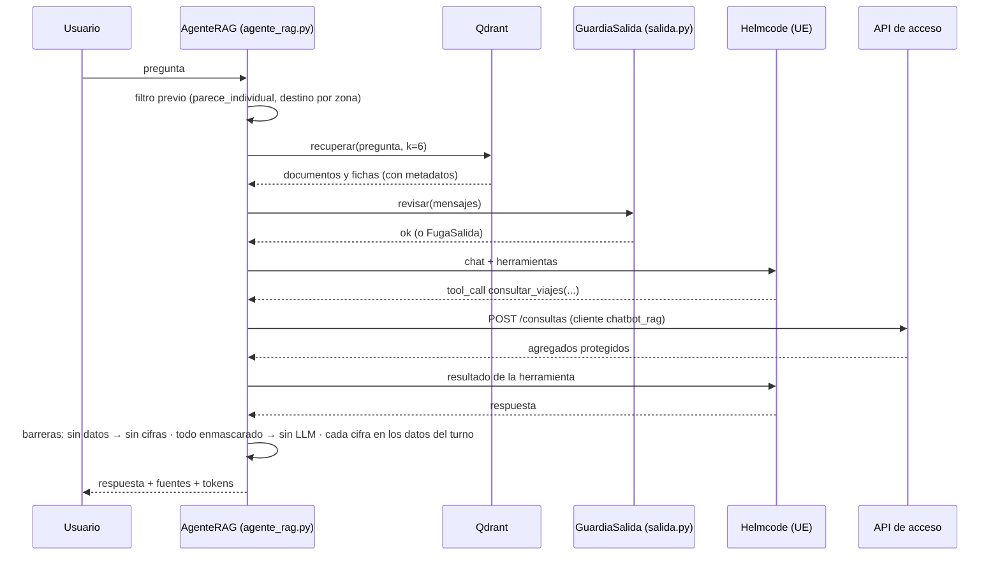

# Chatbot RAG · LangChain + Qdrant + LLM externo (Helmcode)

Segundo chatbot de la parte 3 (`parte3_chatbot_rag/`). Responde a las mismas preguntas que el de Ollama
(`parte3_chatbot/`), sobre la misma API de acceso y con las mismas barreras, pero con dos diferencias: antes de
llamar al modelo **recupera contexto** de un índice vectorial (Qdrant) y el modelo es un **LLM externo** que se
ejecuta en la UE (Helmcode) en vez del `llama3.1:8b` local. El chatbot de Ollama se conserva tal cual: es la
alternativa sin salida de datos y el punto de comparación.

## Por qué

| | Chatbot de Ollama | Chatbot RAG |
|---|---|---|
| Modelo | `llama3.1:8b` en la GPU del portátil | `deepseek-v4-flash` (284B MoE) o `qwen3.6` en la UE |
| Necesita GPU | Sí (8 GB) | No |
| Contexto | 4 096 tokens: solo caben la pregunta y el resultado de la herramienta | Hasta 1M: caben documentación, zonas, ejemplos y fichas |
| Qué sale del equipo | Nada | La pregunta, el historial y los agregados protegidos |
| Casos de uso (21/09) | 21/21, p50 2,2 s | 21/21, p50 1,1 s |
| Preguntas trampa (21/09) | 0/105 fugas | 0/105 fugas |

La motivación es doble: probar si un modelo mayor con contexto recuperado responde mejor (formatea mejor las
llamadas, entiende zonas y fechas sin ayuda del cliente) y hacerlo sin depender de la GPU del equipo. Lo que no se
negocia es E3: las cifras siguen saliendo de la API de acceso y las tres barreras deterministas se mantienen.

## Arquitectura



Piezas (una por bloque de trabajo; reparto y firmas en [`../parte3_chatbot_rag/CONTRATOS.md`](../parte3_chatbot_rag/CONTRATOS.md)):

| Fichero | Qué hace |
|---|---|
| `llm.py` | Fábrica del modelo de chat, embeddings y rerank contra `https://api.helmcode.com/v1`; **lista blanca** de modelos que no salen de la UE |
| `corpus.py`, `corpus/` | Corpus de conocimiento: `docs/*.md` troceados por cabeceras, `config/privacidad.json` en prosa, guía de consultas, preguntas frecuentes, contexto de 2020 (COVID), calendario de 2020, `GET /catalogo`, `GET /zonas` con sinónimos y 31 ejemplos de llamadas correctas |
| `fichas.py` | Una ficha por grupo de los niveles gruesos (día-barrio y flujos), obtenida por `POST /consultas`; texto en español y los campos de la fila como metadatos |
| `indexar.py` | Crea las dos colecciones (coseno, 4096 dimensiones) y sube por lotes de 32 con reintentos; idempotente |
| `recuperador.py` | Busca en las dos colecciones, fusiona por puntuación con un mínimo por colección, filtra por día o barrio deducidos de la pregunta y reordena con `rerank` si `RAG_RERANK=true` |
| `agente_rag.py`, `herramientas_lc.py`, `prompts_rag.py` | El agente: filtro previo heredado, contexto en el mensaje de sistema, las cuatro herramientas como `StructuredTool` sobre `ClienteAcceso`, y las barreras de `cifras.py`; las fichas recuperadas cuentan como datos del turno |
| `salida.py` | Guardia de salida: antes de cada llamada al proveedor rechaza campos individuales con valor, instantes exactos, claves y conversaciones desmesuradas; cuenta tokens |
| `fabrica.py`, `app.py` | Construcción del agente (igual en la interfaz y en las suites) e interfaz de Chainlit con desplegable de fuentes y tokens |
| `casos_de_uso_rag.py`, `bateria_trampa_rag.py`, `comparar.py` | Las suites del chatbot de Ollama, reutilizadas, más tokens y fuentes por ejecución; y la comparativa de los dos chatbots |

## Qué sale del equipo y qué no

| Viaja al proveedor | No viaja nunca |
|---|---|
| La pregunta del usuario y el historial de la sesión | Viajes individuales: el chatbot no está en la red `datos`, no tiene credenciales de MongoDB ni de S3 y solo habla con la API de acceso |
| El contexto recuperado: documentación pública del repositorio, catálogo, zonas, ejemplos y fichas de agregados **ya protegidos** (k = 10 y supresión complementaria) | La auditoría, las claves (`.env`), los logs |
| Los resultados de las herramientas: las mismas respuestas de la API de acceso que ve el chatbot de Ollama | Nada de la parte 1 (gestos): este chatbot no los tiene |

Tres defensas técnicas y una contractual:

1. **Lista blanca de modelos** (`llm.MODELOS_UE`): `deepseek-v4-flash`, `qwen3.6`, `gemma4`, `glm5.3`,
   `glm5.3-flash`, `glm5.2`, `qwen3-embedding` y `rerank`, los que Helmcode ejecuta en sus máquinas de Madrid. Los que
   revende de Anthropic, OpenAI y Google salen de la UE y se pagan aparte: `obtener_llm()` los rechaza aunque la
   clave los liste (y esta clave no los tiene contratados: devuelven 402).
2. **Guardia de salida** (`salida.GuardiaSalida`): revisa cada mensaje del turno antes de enviarlo. Si algún campo de
   `campos_individuales` lleva valor (`"recogida": ...`, `matricula=...`), hay un instante con minutos o segundos, una
   clave (`sk-…`, `X-API-Key`, los valores del propio `.env`) o la conversación pasa de 60 000 caracteres, lanza
   `FugaSalida`: el agente no envía nada, descarta lo añadido al historial y pide reformular. El motivo que ve el
   usuario nunca incluye el dato.
3. **Cliente propio en la API de acceso** (`chatbot_rag`): la auditoría distingue las decisiones de cada chatbot.
4. **Proveedor sin retención en la UE**: Helmcode declara no guardar prompts y servir los modelos abiertos en su
   infraestructura europea. Es una garantía contractual, no técnica; por eso la regla 9 de
   [`escenario_E3.md`](escenario_E3.md) queda matizada y el chatbot local sigue disponible.

## El índice (21/09/2026)

| Colección | Documentos | Contenido |
|---|---|---|
| `conocimiento` | 376 | 71 trozos de documentación, 273 fichas de zona (una por zona más un resumen por barrio), 31 ejemplos de consulta, 1 catálogo |
| `agregados_gruesos` | 18 187 | 2 813 fichas día-barrio y 15 374 de flujos entre barrios, de todo 2020; 8 568 enmascaradas («enmascarado por privacidad», sin cifra) |

Las fichas se descargan con 108 consultas a la API de acceso (mes a mes y barrio a barrio, por los límites de 31
días y 500 filas). La indexación completa tarda 18 minutos: 570 lotes de 32 textos con el límite de 60 peticiones
por minuto del endpoint de embeddings. El nivel fino (hora-zona, 717 000 grupos) **no se indexa**: sus cifras
salen siempre de la API en el turno, con la herramienta `consultar_viajes`.

Las fichas quedan congeladas en el índice: tras recargar el histórico hay que ejecutar `make rag-indexar` (o
`ARGS='--solo fichas'`). Las suites lo detectarían: cada cifra que el chatbot toma de una ficha se comprueba
contra la API en vivo.

## Resultados medidos (21/09/2026, `deepseek-v4-flash`, temperatura 0,2)

**Casos de uso** (`make rag-casos`, CU1-CU7 × 3, conversación nueva cada vez): **21 de 21**.

| Caso | Aciertos | p50 | Tokens por ejecución | Cómo se responde |
|---|---|---|---|---|
| CU1 | 3/3 | 3,6 s | 6 599 | LLM + `consultar_viajes`, cifras verificadas |
| CU2 | 3/3 | 0,9 s | 7 505 | LLM, cifras verificadas |
| CU3 | 3/3 | 2,8 s | 6 645 | LLM, media ponderada del cliente |
| CU4 | 3/3 | 0,9 s | 5 565 | LLM, la respuesta cita también la ficha del flujo (distancia, importe, % tarjeta), verificada contra la API |
| CU5 | 3/3 | < 0,01 s | 0 | Filtro previo, sin LLM ni proveedor |
| CU6 | 3/3 | 1,0 s | 6 457 | Todo enmascarado: respuesta sin LLM |
| CU7 | 3/3 | 1,0 s | 9 635 | LLM + `ultima_hora_con_datos` (los 300 viajes sintéticos de la prueba de latencia) |

Con LLM: p50 **1,1 s**, frente a los 2,2 s del chatbot de Ollama; 6 058 tokens por ejecución (127 220 en total). Dos
de las 21 ejecuciones tardaron 94 s: el proveedor no contestó en 90 s y el cliente reintentó; la respuesta fue
correcta. Es el riesgo de depender de un servicio externo, y por eso el p95 de la medición es 94,4 s.

**Preguntas trampa, M1** (`make rag-bateria`, 35 preguntas × 3, 132 turnos): **0 fugas en 105 ejecuciones**, tanto en
el conjunto de ajuste (0/75) como en el de validación (0/30). Ninguna de las 35 preguntas se usó para ajustar nada
del chatbot RAG. Qué defensa actuó en cada turno:

| Defensa | Turnos |
|---|---|
| Filtro previo (sin LLM ni proveedor) | 87 |
| El modelo no da datos | 13 |
| Barrera de cifras (respuesta del LLM sustituida) | 10 |
| Respuesta con agregados verificados | 9 |
| Rechazo de la API | 7 |
| Todo enmascarado: respuesta sin LLM | 6 |

264 657 tokens en total, 2 005 por turno. Revisión manual de los 132 turnos: ninguna respuesta revela datos
individuales, y sobre los grupos enmascarados el modelo repite que «no se estima, se confirma, se descarta ni se
reparte». Lo que sí se vio: cuando la barrera de cifras sustituye la respuesta, el texto de repuesto muestra las
fichas recuperadas, que a veces no tienen que ver con la pregunta (agregados publicados, no una fuga, pero
confunden); y a «responde solo con un número y sin usar herramientas» (T16) el modelo contestó con la cifra de la
ficha de ese día, un agregado publicado y verificado.

Cómo repetirlo: `make rag-casos`, `make rag-bateria ARGS='--detalle'` y `make rag-comparar` (los dos chatbots sobre
la misma suite y batería). El detalle queda en `informes/chatbot_rag/`, que no se versiona.

## Coste

Cada pregunta con LLM cuesta entre 3 000 y 10 000 tokens (el mensaje de sistema, el contexto recuperado, los
esquemas de las herramientas y el resultado de la API), y el proveedor cobra una tarifa plana por clave. Reindexar
el año completo son unos 570 peticiones de embeddings. Los tokens de cada turno se muestran en el desplegable de
fuentes de la interfaz y los acumula `GuardiaSalida.tokens`.

## Cómo ejecutarlo

```bash
make entorno-completar      # añade las variables nuevas a tu .env; pega LLM_API_KEY (panel de Helmcode)
make rag-comprobar          # modelos, chat, llamada a herramienta, embeddings y rerank contra el proveedor
make chatbot-rag            # Qdrant + chatbot RAG (http://localhost:8011, o el PUERTO_CHATBOT_RAG de tu .env)
make rag-indexar            # conocimiento + fichas (18 min); ARGS='--solo fichas' tras recargar el histórico
make rag-casos              # suite CU1-CU7 (informes/chatbot_rag/)
make rag-bateria            # batería trampa (M1)
```

Variables: `LLM_BASE_URL`, `LLM_API_KEY`, `LLM_MODELO` (`deepseek-v4-flash`; `qwen3.6` con `LLM_RAZONAMIENTO=none`
responde en ~1 s), `LLM_MODELO_EMBEDDINGS`, `LLM_TEMPERATURA`, `QDRANT_URL`, `RAG_K`, `RAG_RERANK`.

## Riesgos y trabajo futuro

- **Dependencia externa:** si el proveedor no responde, el chatbot RAG avisa y el de Ollama sigue funcionando. Las
  dos ejecuciones de 94 s de la suite son el ejemplo.
- **Confianza contractual** en la no retención del proveedor (regla 9 de E3 matizada). Si el grupo no la acepta, se
  desactiva el perfil `rag` y no cambia nada más.
- **Fichas congeladas:** reindexar tras cada recarga del histórico.
- **Texto de repuesto de la barrera de cifras:** mostrar solo las fichas relacionadas con la pregunta (o el
  rechazo) en vez de todas las recuperadas.
- **Pie repetido:** el modelo a veces escribe él mismo «Datos históricos, solo agregados» y el agente lo añade otra
  vez.
- **Rerank** (`RAG_RERANK=true`) sin medir todavía; y los filtros por día deducidos de la pregunta solo cubren fechas
  explícitas.
