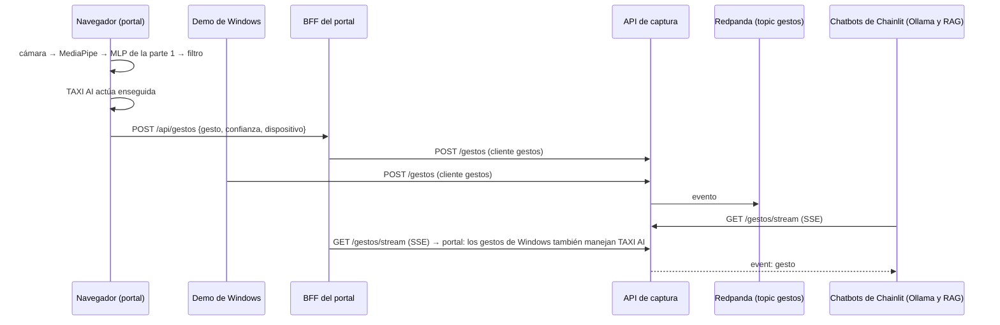

# Integración gestos ↔ plataforma ↔ chatbots

Es la caja «Integración» de la diapositiva 5: los gestos de la parte 1 entran en la plataforma como una fuente de
datos más, y los chatbots de la parte 3 reaccionan a ellos. Hay dos formas de hacer el gesto, y las dos acaban en
el mismo sitio:

| Dónde se reconoce | Con qué | Cuándo usarla |
|---|---|---|
| **El navegador**, en el portal (botón «Gestos», abajo a la izquierda, como el de TAXI AI) | MediaPipe para web (los 21 puntos de la mano) y **el MLP de la parte 1** exportado a JSON (`parte1_gestos/entrenamiento/exportar_web.py`) | En la demo y en la web pública de Vercel: no hace falta Windows ni Python, basta una cámara |
| **La demo de Windows** (`parte1_gestos/demo/src/demo-gestures-PIDS.py`) | El pipeline de la parte 1 en Python (Keras) | Para enseñar la parte 1 tal cual, con su ventana y los comandos del tanque |



## Qué hace cada gesto

Una sola tabla, [`config/gestos.json`](../config/gestos.json), para los tres chatbots: los dos de Chainlit la leen
con [`parte3_chatbot/gestos.py`](../parte3_chatbot/gestos.py) y TAXI AI con `parte4_frontend/web/src/gestos/tabla.ts`.

| Gesto | Acción | Chainlit (Ollama y RAG) | TAXI AI (portal) |
|---|---|---|---|
| ✌️ `scissors` | Otra pregunta | Hace una pregunta al azar (plantillas de `variantes`) | Igual; en la demostración, una de las grabadas |
| 👍 `thumbsup` | Cambiar de motor | — | Pasa de Ollama a DeepSeek y al revés (conversación nueva); si el otro no está disponible, lo dice |
| ✋ `paper` | Siguiente sección | — | Pasa a la siguiente sección del menú y, tras la última, a la primera. TAXI AI no es una sección: sigue abierto |
| 👌 `ok` | Leer en voz alta | — | Lee la última respuesta (síntesis de voz del navegador); si ya está leyendo, la calla |
| 🤘 `rockandroll` | Abrir TAXI AI | — | Abre el panel desde cualquier página |
| ✊ `rock` | Cerrar TAXI AI | — | Cierra el panel; la conversación sigue |

Por qué estas: **otra pregunta** recorre lo que se puede consultar sin teclado; **cambiar de motor** enseña los dos
chatbots (el local y el de la UE) con la misma pregunta; **siguiente sección** recorre el portal con la mano; **leer en
voz alta** es para usar el asistente sin mirar la pantalla (un operador, una sala de control), y **abrir y cerrar**
manejan el panel. Hasta el 23/09, 👍 confirmaba la alternativa de un rechazo y ✋ la cancelaba (así sale en el vídeo
`docs/capturas/cu8_gesto.mp4`); ahora eso se hace con los botones «✅ Consultar la alternativa» / «✖ Cancelar».

Las preguntas de ✌️ salen al azar de `variantes` en la misma tabla: 11 plantillas (volumen por zona y franja, hora
punta, importe, propina, pago con tarjeta, distancia, flujos entre barrios, Staten Island por horas y dos peticiones
de un viaje concreto, que el filtro rechaza y enseña su alternativa) con 11 zonas, 5 barrios, 14 días de
2020 y varias franjas: cientos de preguntas distintas, que no son las de las casillas de ejemplo del chat. Las genera
`pregunta_al_azar` (`parte3_chatbot/gestos.py`), la misma función en los dos Chainlit y en el portal (el BFF la da en
`GET /api/gestos/pregunta`). La demostración pública no tiene modelo, así que ahí ✌️ recorre las de `preguntas`, que
tienen conversación grabada.

## Privacidad (E3)

- **Qué sale de la cámara:** solo la etiqueta del gesto y la confianza, nunca la imagen ni los puntos de la mano. En
  el navegador la imagen se procesa en el propio navegador (WebAssembly) y no se envía a nadie.
- **Qué se descarga:** al activar los gestos, el navegador baja el motor de MediaPipe (jsDelivr) y su modelo de la
  mano (Google), con la versión fija, y el MLP de la parte 1 (unos 50 KiB, del propio portal). Son ficheros de código
  y pesos: no llevan datos de nadie.
- **Anti-rebote:** un gesto solo cuenta si se mantiene cuatro predicciones seguidas (una cada 0,25 s, como la demo de
  Windows) con confianza de al menos 0,85, y el mismo no se repite en 3 s. Es la misma lógica en
  `cliente_gestos.py` y en `web/src/gestos/filtro.ts`.
- **Por qué HTTP y no Kafka desde Windows:** el cliente nativo de Kafka carga una DLL que Smart App Control puede
  bloquear; `cliente_gestos.py` solo usa la biblioteca estándar.

## Cómo probarlo

**En el portal (la forma más sencilla):** http://localhost:8020 → botón «Gestos» (abajo a la izquierda; en la web pública, encima del aviso «En vivo») y permitir la cámara. La
tarjeta enseña el vídeo en espejo con los puntos de la mano, el gesto que ve el modelo y una barra que se llena al
sostenerlo. Funciona igual en https://happytaxi-rust.vercel.app: en vivo (con el túnel) los gestos entran además en
la plataforma; en la demostración se quedan en el navegador y TAXI AI contesta con las conversaciones grabadas. La
cámara solo se puede usar en https o en localhost.

**Con la demo de Windows**, con la plataforma levantada en WSL:

1. En `.env`, `GESTOS_ACTIVOS=true` y `make chatbot` / `make chatbot-rag` (recrean los contenedores si cambió el
   entorno). El portal no necesita nada: escucha los gestos de la plataforma siempre que tenga la clave de gestos.
2. En Windows:

```powershell
$env:PIDS_CLAVE_GESTOS = "<CAPTURA_CLAVE_GESTOS del .env>"
python parte1_gestos\demo\src\demo-gestures-PIDS.py
```

3. En un chatbot (Chainlit en :8010 o :8011, o TAXI AI en el portal), una pregunta individual (por ejemplo «Dame el
   viaje de las 3:12 del 15 de enero desde Times Square»), y ✌️ para otra al azar. En el portal, además, 👍 cambia
   de motor y ✋ pasa de sección.

Sin cámara, el mismo POST que haría la demo:

```bash
source .env && python integracion/cliente_gestos.py --clave "$CAPTURA_CLAVE_GESTOS" --gesto scissors
```

El gesto llega a todos los chats abiertos a la vez (cada pestaña de Chainlit y cada portal con sesión): conviene tener
uno solo abierto durante la demo. La pestaña del portal que hizo el gesto no lo repite al recibirlo de vuelta.

## Comprobado

- El MLP en TypeScript da las mismas probabilidades que en Python (a 5 decimales) con 24 imágenes reales del dataset
  (`web/src/gestos/modelo.test.ts`); con numpy, el modelo exportado acierta el 98,4 % de las 2931 imágenes con mano.
- En Chromium, con una cámara simulada a partir de fotos del dataset (solo en local; las fotos no se publican):
  ✌️ reconocido al 99 %, `POST /api/gestos` → cola `gestos` → TAXI AI pregunta y responde.
- Un ✌️ enviado como la demo de Windows: los dos chatbots de Chainlit hacen la pregunta y contestan; en el portal,
  🤘 abre TAXI AI, ✌️ pregunta y ✊ lo cierra.
