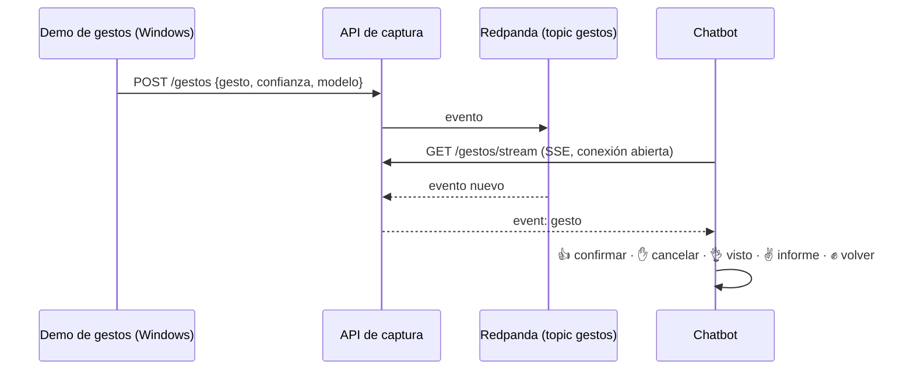

# Integración gestos ↔ plataforma ↔ chatbot (última fase, opcional)

Es la caja «Integración» de la diapositiva 5: los gestos de la parte 1 entran en la plataforma como
una fuente de datos más y el chatbot reacciona a ellos.

- **Qué sale de la cámara:** solo la etiqueta y la confianza, nunca la imagen ni los puntos de la mano (E3).
- **Por qué HTTP y no Kafka desde Windows:** el cliente nativo de Kafka carga una DLL que Smart App
  Control puede bloquear; `cliente_gestos.py` solo usa la biblioteca estándar.
- **Anti-rebote:** solo se envía un gesto cuando se mantiene varias predicciones seguidas con confianza
  suficiente, y no se repite el mismo en 3 s.

## Pasos pendientes
1. Llamar a `EmisorGestos.observar(pred, conf)` desde `demo-gestures-PIDS.py`.
2. Poner `GESTOS_ACTIVOS=true` en `.env` y reiniciar el chatbot.
3. Probar: `python integracion/cliente_gestos.py --clave <CAPTURA_CLAVE_GESTOS> --gesto thumbsup`.
