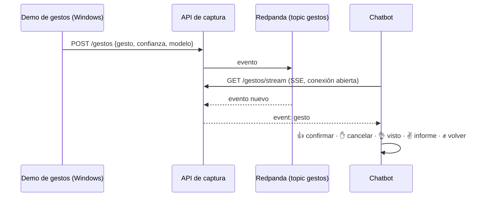

# Integración gestos ↔ plataforma ↔ chatbot (última fase, opcional)

Es la caja «Integración» de la diapositiva 5: los gestos de la parte 1 entran en la plataforma como
una fuente de datos más y el chatbot reacciona a ellos.



- **Qué sale de la cámara:** solo la etiqueta y la confianza, nunca la imagen ni los puntos de la mano (E3).
- **Por qué HTTP y no Kafka desde Windows:** el cliente nativo de Kafka carga una DLL que Smart App
  Control puede bloquear; `cliente_gestos.py` solo usa la biblioteca estándar.
- **Anti-rebote:** solo se envía un gesto cuando se mantiene varias predicciones seguidas con confianza
  suficiente, y no se repite el mismo en 3 s.

## Cómo probarlo

La demo de Windows llama a `EmisorGestos.observar(pred, conf)` en cada predicción (una cada 0,25 s, o al
soltar la mano). Solo sale a la red si `PIDS_CLAVE_GESTOS` está definida: sin esa variable la demo sigue
siendo solo de la parte 1.

1. En `.env`, `GESTOS_ACTIVOS=true` y reiniciar el chatbot (`make chatbot` recrea el contenedor si cambió el entorno).
2. En Windows, con la plataforma levantada en WSL:

```powershell
$env:PIDS_CLAVE_GESTOS = "<CAPTURA_CLAVE_GESTOS del .env>"
python parte1_gestos\demo\src\demo-gestures-PIDS.py
```

3. En el chatbot, una pregunta individual (por ejemplo «Dame el viaje de las 3:12 desde Times Square»).
   El bot propone la alternativa. 👍 (`thumbsup`) la ejecuta; ✋ (`paper`) la cancela.

Sin cámara, el mismo POST que haría la demo:

```bash
python integracion/cliente_gestos.py --clave "$CAPTURA_CLAVE_GESTOS" --gesto thumbsup
```
